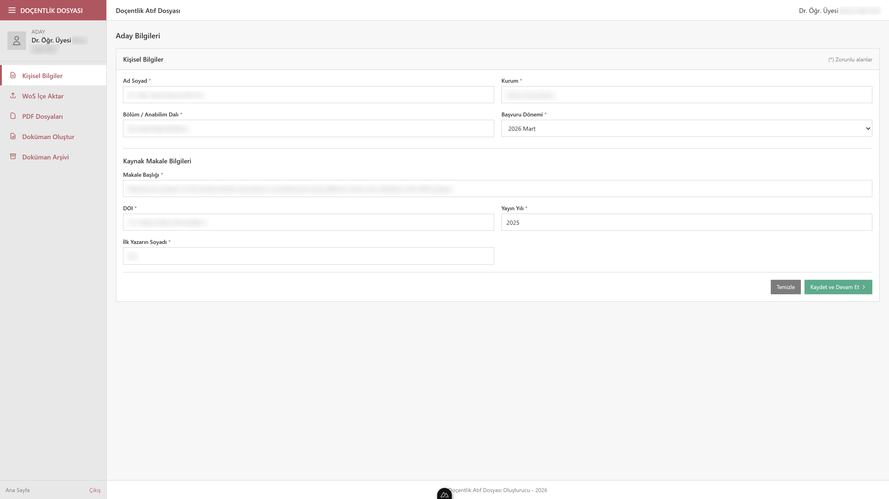
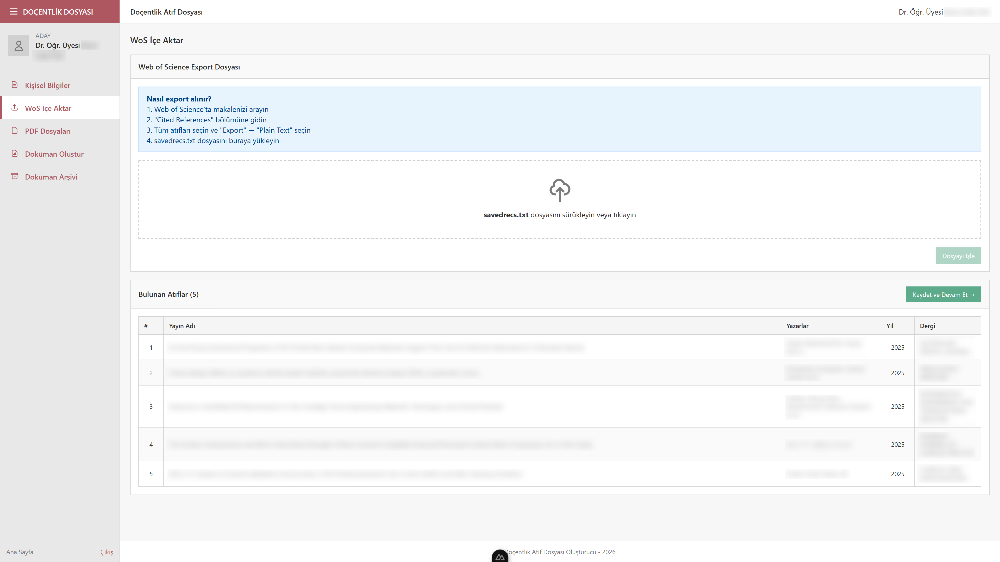
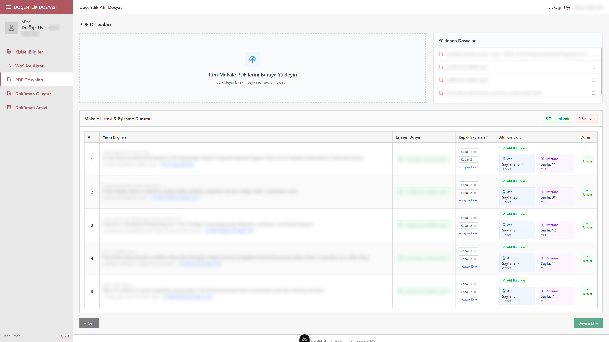
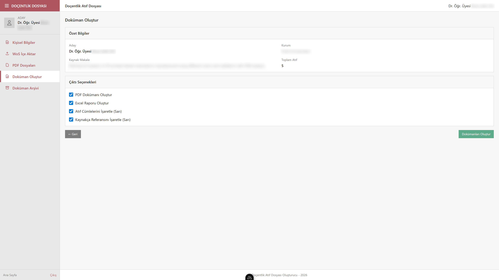
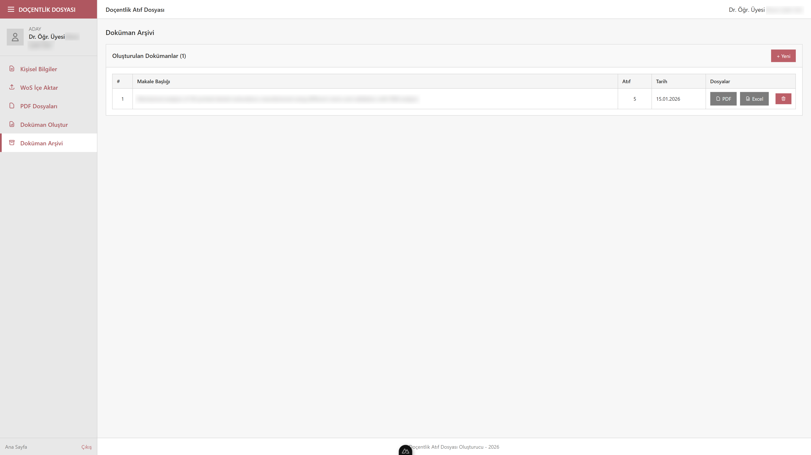

# Docentlik Atif Dosyasi Olusturma Araci

Akademik personelin docentlik basvurulari icin gerekli atif dosyalarini otomatik olarak hazirlayan web tabanli bir uygulamadir. 2025 YOK kriterlerine uygun formatta dokuman uretir.

## Ozellikler

- Web of Science export dosyalarindan atif bilgilerini otomatik ayristirma
- PDF tam metinlerinden atif sayfalarini tespit etme
- Atif cumleleri ve kaynak referanslarini sari ile vurgulama
- Kapak ve unvan sayfalari ekleme destegi
- YOK formatina uygun PDF dokuman olusturma
- Excel raporu olusturma
- Dokuman arsivi yonetimi

## Sistem Gereksinimleri

- Python 3.10 veya uzeri
- Node.js 18 veya uzeri
- Windows 10/11

## Kurulum

### 1. Python Bagimliliklari

```bash
pip install -r requirements.txt
```

### 2. Web Arayuzu

```bash
cd web
npm install
```

## Calistirma

### Gelistirme Modu

**Python Backend (Terminal 1):**
```bash
python main.py
```

**Web Arayuzu (Terminal 2):**
```bash
cd web
npm run dev
```

Tarayicinizda `http://localhost:3000` adresini acin.

## Kullanim

### Adim 1: Aday Bilgileri
Kisisel bilgilerinizi ve kaynak makale bilgilerini girin.



### Adim 2: WoS Dosyasi Yukleme
Web of Science'tan export ettiginiz `savedrecs.txt` dosyasini yukleyin.



### Adim 3: PDF Dosyalari
Atif yapan makalelerin tam metin PDF dosyalarini yukleyin. Sistem otomatik olarak eslesme yapar.



### Adim 4: Kapak Sayfalari
Her makale icin dergi kapak/unvan sayfalarini ekleyin (PNG, JPG veya PDF).

### Adim 5: Dokuman Olusturma
Tum veriler tamamlandiginda "Dokumanlari Olustur" butonuna tiklayin.



### Adim 6: Dokuman Arsivi
Olusturulan tum dokumanlar arsivde saklanir.



## Proje Yapisi

```
docentlikatif/
├── config.py              # Yapilandirma ve veri siniflari
├── document_builder.py    # PDF dokuman olusturucu
├── pdf_processor.py       # PDF isleme ve atif bulucu
├── check_citation_cli.py  # Atif kontrol CLI araci
├── import_utils.py        # WoS dosya ayrıstirici
├── main.py               # Ana CLI uygulamasi
├── requirements.txt      # Python bagimliliklari
├── fonts/                # PDF icin font dosyalari
├── downloads/            # Yuklenen PDF dosyalari
├── output/               # Olusturulan dokumanlar
└── web/                  # Nuxt.js web arayuzu
    ├── app/              # Vue bilesenleri ve sayfalar
    ├── server/           # API endpointleri
    └── public/           # Statik dosyalar
```

## Olusturulan Dokuman Formati

Her atif icin asagidaki bolumleri icerir:

1. **Atif Listesi** - Tum atif yapan makalelerin kunye bilgileri
2. **Yayinin Unvan Sayfasi** - Dergi kapak/unvan sayfasi (kullanici tarafindan yuklenir)
3. **Eserin Baslik Sayfasi** - Atif yapan makalenin ilk sayfasi
4. **Atif Yapilan Sayfalar** - Kaynak makalenin referans verildigi sayfalar (sari ile vurgulu)
5. **Kaynak Sayfasi** - References bolumu (atif numarasi vurgulu)

## Lisans

Bu proje GPL v3 lisansi altinda yayinlanmistir.

## Iletisim

Sorulariniz icin GitHub Issues bolumunu kullanabilirsiniz.
